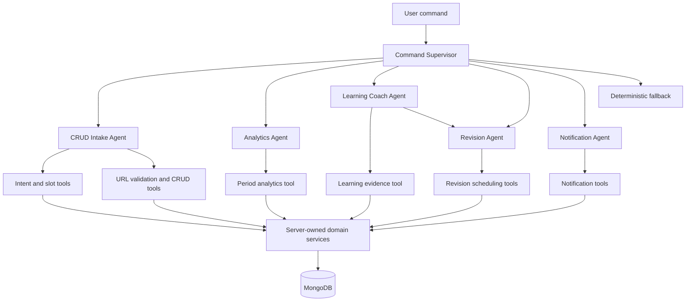

# AlgoPulse Agent Architecture

## 1. Agent Topology



## 2. Agent Responsibilities

### Command Supervisor

**Purpose:** Route a validated user command to the correct specialized agent.

**Input:** authenticated text command and optional conversation ID.

**Output:** typed route decision, confidence, required slots, or unsupported-command response.

**Allowed actions:** call `resolve_command_intent`, load conversation state, and invoke one specialized route.

**Must not:** access MongoDB directly, execute CRUD, or decide database facts.

### CRUD Intake Agent

**Purpose:** Handle add, list, update, and delete workflows.

**Input:** route plus extracted URL, title, status, difficulty, tags, search text, or candidate choice.

**Output:** clarification question, candidate list, confirmation preview, or typed CRUD result.

**Allowed tools:** `get_problem_candidates`, `validate_submission_url`, `create_problem_after_confirmation`, `update_problem_after_confirmation`, and `delete_problem_after_confirmation`.

**Must not:** invent missing fields, silently mutate data, or skip confirmation.

### Analytics Agent

**Purpose:** Explain current week/month activity.

**Input:** `period=week|month` and the user's authenticated scope.

**Output:** grounded summary containing exact dates, timezone, totals, daily activity, and platform breakdown.

**Allowed tools:** `get_period_analytics`.

**Must not:** calculate alternative dates from memory or invent platform totals.

### Learning Coach Agent

**Purpose:** Explain current learning patterns and identify evidence-supported weak topics.

**Input:** aggregated learning evidence and candidate problem IDs.

**Output:** evidence-aware explanation, confidence, weak-topic candidates, and revision request.

**Allowed tools:** `get_learning_evidence` and the revision-agent handoff.

**Must not:** label a topic weak below the evidence threshold or expose another user's data.

### Revision Agent

**Purpose:** Turn ranked candidates into a spaced revision plan.

**Input:** candidate problem IDs, reason codes, review history, and current time in the user's timezone.

**Output:** review priority, next review date, interval, and explanation.

**Allowed tools:** `schedule_revision` and `mark_revision_reviewed`.

**Must not:** create problem records or change status without the CRUD workflow.

### Notification Agent

**Purpose:** Create and present due notifications reliably.

**Input:** due revision items and notification preferences.

**Output:** idempotent notification records and notification-center results.

**Allowed tools:** `create_due_notification` plus notification read/preferences tools.

**Must not:** create repeated notifications on every dashboard request.

## 3. Agent Communication Contract

Agents communicate through a shared typed state object, not natural-language messages:

```json
{
  "conversation_id": "ObjectId",
  "user_id": "ObjectId",
  "intent": "analyse_learning",
  "state": "awaiting_confirmation",
  "slots": {
    "period": null,
    "problem_id": null,
    "status": null
  },
  "evidence": {
    "candidate_problem_ids": ["ObjectId"],
    "reason_codes": ["recent_tried", "repeated_logic_gap"],
    "confidence": 0.86
  },
  "confirmation_required": false,
  "tool_results": []
}
```

Rules:

1. Every field has a schema and an owner.
2. Agent nodes may add proposals to state but cannot override authenticated identity.
3. Tool results are immutable evidence for the rest of the graph.
4. A mutation node runs only when `confirmation_required=false` because an explicit confirmation has already been recorded.
5. State is persisted for resumability and expires through TTL cleanup.

## 4. Recommended LangGraph Shape

```text
START
  -> supervisor
  -> route_by_intent
      -> crud_intake
      -> analytics
      -> learning_coach
      -> notification
  -> validate_output
  -> clarification_or_confirmation_or_result
  -> END
```

The learning route may continue as:

```text
learning_coach
  -> get_learning_evidence
  -> deterministic_rank
  -> revision_agent
  -> schedule_revision
  -> notification_agent
  -> result
```

Use conditional edges for missing fields, invalid output, confirmation rejection, tool failure, and model outage. Keep graph nodes small enough to unit-test independently.

## 5. Tool Contracts

| Tool                                | Reads                                | Writes              | Called by          |
| ----------------------------------- | ------------------------------------ | ------------------- | ------------------ |
| `resolve_command_intent`            | Request text and allowed intent list | None                | Supervisor         |
| `get_problem_candidates`            | User's problem records               | None                | CRUD agent         |
| `validate_submission_url`           | URL string                           | None                | CRUD agent         |
| `get_period_analytics`              | User records and timezone            | None                | Analytics agent    |
| `get_learning_evidence`             | User problem and revision records    | None                | Learning agent     |
| `create_problem_after_confirmation` | Validated preview                    | Problem record      | CRUD agent         |
| `update_problem_after_confirmation` | Candidate and patch                  | Problem record      | CRUD agent         |
| `delete_problem_after_confirmation` | Candidate ID                         | Problem record      | CRUD agent         |
| `schedule_revision`                 | Candidate and review result          | Revision item       | Revision agent     |
| `mark_revision_reviewed`            | Revision item                        | Revision item       | Revision agent     |
| `create_due_notification`           | Due revision item                    | Notification record | Notification agent |

Every tool validates arguments with Pydantic, applies `current_user.id`, and returns a typed result or typed error.

## 6. Single-Agent Fallback

When the model provider is unavailable, the API must still support:

- Normal CRUD endpoints.
- Fixed week/month analytics endpoints.
- Deterministic due-revision retrieval.
- Notification-center reads.

The fallback can omit natural-language interpretation, but it must never fabricate a successful agent result.
