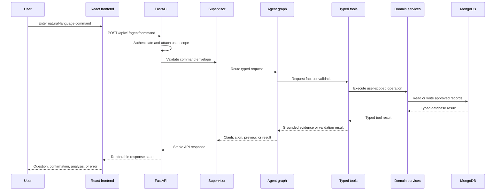
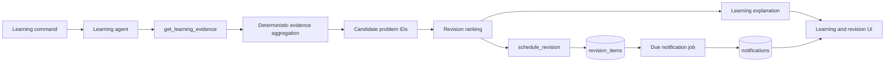

# AlgoPulse Data Flow Architecture

## 1. Request Lifecycle

Every command follows the same controlled path:



## 2. Add Problem Flow

Example command: `add https://example.com/submission/123`

1. The API authenticates the user and creates or resumes an `agent_conversations` record.
2. The supervisor classifies the request as `add_problem`.
3. The CRUD intake agent extracts the candidate URL and optional fields.
4. `validate_submission_url` checks the URL and detects the platform.
5. The tool returns only validated facts. It does not accept a model-invented platform.
6. The agent asks for missing title, status, difficulty, tags, or other required fields.
7. The user supplies the missing fields.
8. Pydantic validates the complete `ProblemCreate` preview.
9. The API asks for explicit confirmation.
10. `create_problem_after_confirmation` calls the normal CRUD service.
11. The response contains the created record ID and a concise explanation.

No database write occurs before step 10.

## 3. Analytics Flow

Example commands: `analyse my current week` or `analyse my current month`

1. The supervisor routes to the analytics agent.
2. The analytics agent extracts `period=week` or `period=month`.
3. The analytics tool loads the authenticated user's timezone.
4. The deterministic analytics service resolves the current calendar boundaries, not a rolling duration.
5. MongoDB is queried only for records inside the inclusive date range.
6. The service calculates solved, tried, total, daily activity, and platform counts.
7. The analytics agent converts those typed facts into a readable response.
8. The response includes the exact date range and messages such as:
   - `This week you solved X problems on LeetCode.`
   - `Across other platforms you solved Y problems.`

The model cannot invent totals or dates because those values come from the tool result.

## 4. Current Learning and Revision Flow

Example command: `analyse my current learning`



The evidence service considers:

- Tried and unresolved status.
- Number and recency of attempts.
- Normalized tags and stuck categories.
- Weak-topic evidence thresholds.
- Existing revision outcomes and overdue reviews.
- Solved problems only when they are due or reinforce a weak topic.

The agent explains the evidence and can order candidates, but it cannot create a weakness unsupported by the database.

## 5. State Transitions

```text
received
  -> classified
  -> awaiting_details
  -> validated
  -> awaiting_confirmation
  -> executing
  -> complete

Any state may become:
  -> rejected       invalid input, unsafe output, or unauthorized record
  -> failed         provider/tool/runtime failure
  -> expired        TTL cleanup of abandoned clarification
```

The state is persisted only when resumption is needed. Raw prompts and full transcripts are not required application data.

## 6. Data Ownership

| Data                        | Owner                | Agent access                                        |
| --------------------------- | -------------------- | --------------------------------------------------- |
| User identity and timezone  | Auth/user services   | Read through typed tool                             |
| Problem records             | CRUD service         | Read candidates; write only after confirmation tool |
| Week/month totals           | Analytics service    | Read typed aggregate                                |
| Weak-topic evidence         | Learning service     | Read aggregate and candidate IDs                    |
| Review dates                | Revision scheduler   | Request scheduling through typed tool               |
| Notification delivery state | Notification service | Request creation/read status through typed tool     |

Agents never bypass these owners.
