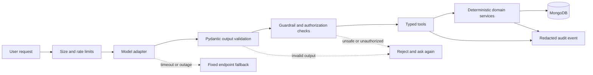

# AlgoPulse Agent Operations and Evaluation Architecture

## 1. Reliability Boundary

The agent layer is an assistant over deterministic application services. Reliability comes from keeping the model outside the database trust boundary.

## 2. Guardrails

Apply these checks before a tool call:

- Validate the model response against a Pydantic schema.
- Allow only registered intent names and registered tools.
- Validate URL, status, difficulty, tags, IDs, dates, and enum values.
- Enforce the authenticated `user_id` in the server context.
- Require confirmation for create, update, delete, and bulk operations.
- Reject model-supplied database filters that could remove user scoping.
- Treat URLs, notes, titles, and imported problem text as untrusted content.
- Apply request size, timeout, retry, rate, and token budgets.

Guardrails should reject unsafe output. They should not silently repair a destructive request.

## 3. Evaluation Layers

### Deterministic unit tests

Test timezone boundaries, inclusive date ranges, platform aggregation, attempt counting, status transitions, spaced intervals, notification uniqueness, and user isolation without a model.

### Agent contract tests

Use mocked model responses to test:

- Intent routing.
- Missing-field questions.
- Confirmation previews.
- Invalid tool arguments.
- Tool timeout and retry behavior.
- Model outage fallback.

### Offline quality evaluations

Use versioned fixtures to measure:

- Intent accuracy.
- Slot extraction accuracy.
- Correct period selection.
- Tool-call validity.
- Groundedness of analytics explanations.
- Unauthorized-data rate.
- Revision recommendation precision.
- Weak-topic ranking quality.

### Browser and integration tests

Verify the complete command console, clarification flow, confirmation rejection, analytics display, learning sheet, review action, notification center, and model-unavailable behavior.

## 4. Observability

Record redacted events containing:

- Conversation ID and authenticated user ID hash.
- Intent and graph state.
- Tool names and result IDs.
- Confirmation state.
- Latency, retry count, token estimate, and error category.

Never record passwords, bearer tokens, raw secrets, full prompts, raw model transcripts, or unnecessary problem notes.

Monitor:

- Model latency and failure rate.
- Invalid structured-output rate.
- Tool error rate.
- Token spend.
- Confirmation abandonment.
- Notification duplication/failure.
- Evaluation regressions.

## 5. Deployment Progression

### Phase 3

- One model adapter.
- One LangGraph process or equivalent supervisor.
- CRUD intake and analytics agents.
- Deterministic fallback endpoints.

### Phase 4

- Learning coach, revision, and notification nodes.
- Durable conversation state.
- Background due-notification worker.
- Revision and notification idempotency.

### Phase 5

- Offline eval pipeline.
- Redacted tracing and audit logs.
- Rate and token budgets.
- Security and prompt-injection tests.
- Production build and browser verification.

Separate services or model providers are optional. Introduce them only when load, isolation, or deployment needs justify the operational cost.

## 6. Failure Behavior

| Failure                 | Required behavior                                                      |
| ----------------------- | ---------------------------------------------------------------------- |
| Invalid model JSON      | Reject output, log redacted error, ask for retry                       |
| Missing required field  | Ask one focused clarification question                                 |
| Invalid URL             | Return validator error; do not create a problem                        |
| Ambiguous update/delete | Show candidates; require selection and confirmation                    |
| Tool timeout            | Retry within budget, then return a recoverable error                   |
| Model outage            | Keep fixed CRUD, analytics, revision, and notification reads available |
| Duplicate command       | Use idempotency key or conversation state; avoid duplicate writes      |
| Notification retry      | Use unique key and safe retry                                          |
| Unauthorized ID         | Return not found or forbidden without revealing another user's record  |
