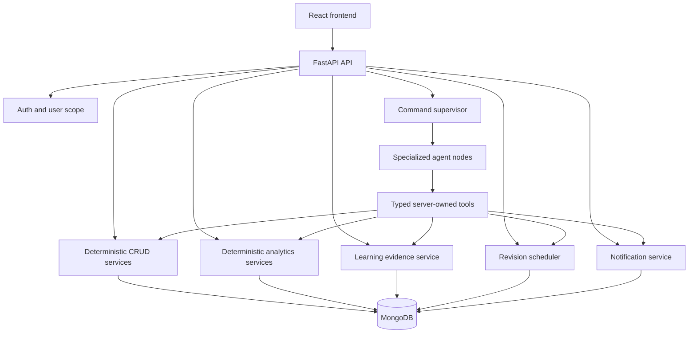

# AlgoPulse Architecture Overview

## 1. Architecture Decision

AlgoPulse is a **controlled supervisor-style multi-agent system** from Phase 3 onward.

It is not a collection of autonomous agents with unrestricted access. The system has:

- One command supervisor that classifies a user request and routes it.
- Specialized agents for CRUD intake, analytics, learning analysis, revision planning, and notifications.
- Deterministic application services that calculate facts and perform database operations.
- Typed tools that are the only boundary between agents and the application data.
- A frontend that receives typed clarification, preview, result, and notification states.

Phase 3 may deploy the specialized responsibilities as LangGraph nodes in one graph process. They are still separate agents by responsibility, but they do not need separate servers or separate model providers.

## 2. Main Boundaries

## 3. Layers

### Presentation layer

React provides the command console, clarification form, confirmation preview, analytics view, learning view, revision sheet, and notification center.

### API layer

FastAPI authenticates the request, attaches `current_user.id`, validates request envelopes, and returns stable response types. The API never trusts an identity or record ID supplied by a model.

### Agent layer

The supervisor and specialized agents interpret language, ask for missing details, summarize evidence, and rank already-approved candidates. They do not own business facts.

### Domain service layer

Deterministic services perform URL validation, CRUD, calendar period calculations, learning evidence aggregation, spaced repetition scheduling, and notification idempotency.

### Persistence layer

MongoDB stores lean user-scoped records. It does not store raw model transcripts, source code, editorials, or large generated revision sheets.

## 4. Core Concepts

- **Structured output**: every model response maps to a Pydantic schema.
- **Tool calling**: agents call narrow server-owned functions, not arbitrary code.
- **Human confirmation**: create, update, delete, and bulk actions stop for explicit confirmation.
- **Grounded generation**: explanations use only tool results and supplied evidence.
- **State machine**: clarification, validation, confirmation, execution, and completion are explicit states.
- **Deterministic core**: facts, scores, date ranges, and writes are reproducible without an LLM.
- **User scoping**: every query and tool call applies the authenticated user ID.
- **Idempotency**: repeated commands and notification jobs do not create duplicate records.

## 5. Recommended Technology Roles

| Concern               | Recommended technology                   | Responsibility                                         |
| --------------------- | ---------------------------------------- | ------------------------------------------------------ |
| API                   | FastAPI                                  | Authentication, request validation, response contracts |
| Schemas               | Pydantic v2                              | Typed model output and tool arguments                  |
| Agent graph           | LangGraph                                | Routing, durable state, resumable clarification        |
| Model adapter         | Provider-native structured output        | JSON/tool calling behind one application interface     |
| Optional abstractions | LangChain                                | Use only when it reduces tool/message boilerplate      |
| Guardrails            | Pydantic first, Guardrails where needed  | Reject malformed or unsafe model output                |
| Database              | MongoDB with Motor                       | User-scoped application records                        |
| Evaluation            | Pytest fixtures plus offline model evals | Regression checks and recommendation quality           |
| Tracing               | LangSmith or equivalent, redacted        | Latency and graph debugging without secrets            |

## 6. Architectural Rule

The model can propose an intent, a question, an explanation, or an ordering. The application decides whether the request is valid, which records exist, what the facts are, whether confirmation is present, and what gets written.
