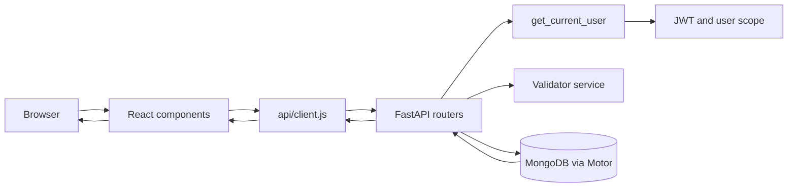

# AlgoPulse Phase Implementation Reference

This document describes what currently exists in the repository, how the implemented code works, and what remains planned for the transition from CRUD to the agentic system.

The implementation status is based on the current files under `backend/` and `frontend/`. Planned features are explicitly marked as planned; they are not currently available in the running application.

---

## 1. Current Status

| Phase | Current state | What it contains |
| --- | --- | --- |
| Phase 1 | Implemented and ready for browser validation | FastAPI app, MongoDB connection, JWT auth, user profile CRUD, problem CRUD, strict submission URL validation, React client |
| Phase 2 | Planned | LeetCode sync, timezone-aware ingestion, deduplication, streak engine, streak UI |
| Phase 3 | Planned | Command supervisor, CRUD intake agent, week/month analytics, clarification and confirmation workflows |
| Phase 4 | Planned | Learning coach, weak-topic analysis, revision scheduler, revision sheet, notifications |
| Phase 5 | Planned | Multi-agent evaluations, guardrails, reliability, auditability, security, production testing |

### What Phase 1 does today

A user can:

1. Register or log in with a username/email and password.
2. Receive a JWT access token and keep it in browser `localStorage`.
3. View and update profile settings.
4. Add a problem using a submission proof URL.
5. Automatically detect Codeforces, CodeChef, AtCoder, and LeetCode URLs.
6. Reject generic problem URLs for platforms with strict submission patterns.
7. Store solved or tried problems with tags, difficulty, notes, and blocker category.
8. List, filter, edit, and delete their own problems.
9. Test URL validation in the validator playground.
10. Delete their account and associated Phase 1 problem/streak records.

### What Phase 1 does not do yet

- It does not accept natural-language commands such as `add <problem link>`.
- It does not ask conversational follow-up questions for missing fields.
- It does not calculate current week/month analytics.
- It does not synchronize LeetCode submissions.
- It does not calculate a daily streak from synced data.
- It does not have learning analysis, revision scheduling, or notifications.
- It does not contain implemented LangChain, LangGraph, Guardrails, or model-provider code.

---

## 2. Repository Structure

```text
backend/
  main.py
  requirements.txt
  app/
    api/
      auth.py
      deps.py
      problems.py
      users.py
      validator.py
    core/
      config.py
      database.py
      security.py
    models/
      schemas.py
    services/
      validator.py
  tests/
    test_phase1.py

frontend/
  index.html
  package.json
  vite.config.js
  src/
    App.jsx
    main.jsx
    api/client.js
    components/
      AuthView.jsx
      Header.jsx
      ProblemCRUD.jsx
      ProfileModal.jsx
      ValidatorPlayground.jsx
    styles/index.css
```

Root command scripts and documentation provide setup, startup, prerequisite checks, and the future-phase architecture.

---

# 3. Phase 1 Backend Implementation

## 3.1 `backend/main.py`

### `lifespan(app: FastAPI)`

**Purpose:** Manage the application lifetime.

**Implementation:**

1. Logs that the Phase 1 backend is starting.
2. Calls `connect_to_mongo()` before requests are served.
3. Yields control to FastAPI while the application is running.
4. Calls `close_mongo_connection()` during shutdown.

### `root_health_check()`

**Route:** `GET /`

**Purpose:** Returns a simple online/status response containing the application name, Phase 1 description, version, and `/docs` location.

### Application initialization

The module also:

- Configures application logging.
- Creates the FastAPI application with title, description, version, and lifespan handler.
- Enables permissive CORS with `allow_origins=["*"]` for the current development client.
- Mounts the routers under `/api/v1`:
  - Authentication.
  - Users.
  - Problems.
  - URL validation.

### Current limitation

The current CORS configuration is suitable for development but should be restricted to known frontend origins before production.

---

## 3.2 `backend/app/core/config.py`

### `Settings`

A Pydantic Settings model containing:

- Application metadata: `PROJECT_NAME`, `VERSION`, `ENVIRONMENT`, `PORT`, `HOST`.
- MongoDB connection: `MONGODB_URL`, `DATABASE_NAME`.
- JWT configuration: `JWT_SECRET_KEY`, `JWT_ALGORITHM`, `ACCESS_TOKEN_EXPIRE_MINUTES`.
- User defaults: `DEFAULT_DAILY_TARGET`, `DEFAULT_TIMEZONE`.

The nested `Config` loads values from `.env` and ignores unknown environment variables.

### `settings`

A global `Settings()` instance imported by the rest of the backend.

### Current limitation

The default JWT secret is present in source code as a development fallback. Production deployment must require a secret from environment configuration.

---

## 3.3 `backend/app/core/database.py`

### `Database`

A container holding the shared `AsyncIOMotorClient` and selected `AsyncIOMotorDatabase` handles.

### `db_instance`

The module-level shared database state used by the application.

### `get_db()`

**Purpose:** Returns the active MongoDB database handle to route handlers and dependencies.

**Implementation:** Returns `db_instance.db` asynchronously.

### `connect_to_mongo()`

**Purpose:** Creates the Motor client, selects the configured database, and creates indexes.

**Implementation:**

1. Creates `AsyncIOMotorClient` with a five-second server-selection timeout.
2. Selects `settings.DATABASE_NAME`.
3. Creates unique indexes for usernames and emails.
4. Creates a unique problem index on `(user_id, platform, p_id)`.
5. Creates problem filtering indexes on `(user_id, status)` and `(user_id, solved_at)`.
6. Creates daily streak indexes on `(user_id, date)` and `(user_id, month)`.
7. Creates a submission deduplication index on `(user_id, sub_id)`.
8. Logs a warning if index creation fails instead of stopping startup.

### `close_mongo_connection()`

**Purpose:** Closes the Motor client during application shutdown.

**Implementation:** Checks whether a client exists, closes it, and logs the result.

### Current limitations

- The `submissions` and `daily_streaks` indexes are prepared for Phase 2 but their feature services are not implemented yet.
- Index initialization catches all exceptions and continues, so deployment checks should verify indexes explicitly.
- The current document-size target is a design rule, not an automated size assertion.

---

## 3.4 `backend/app/core/security.py`

### `pwd_context`

A Passlib `CryptContext` configured for bcrypt password hashing.

### `verify_password(plain_password, hashed_password)`

**Purpose:** Checks a submitted password against the stored bcrypt hash.

### `get_password_hash(password)`

**Purpose:** Creates a salted bcrypt hash for a password before storage.

### `create_access_token(data, expires_delta=None)`

**Purpose:** Creates a signed JWT.

**Implementation:**

1. Copies the supplied payload.
2. Calculates expiration using the optional duration or the configured seven-day default.
3. Adds the `exp` claim.
4. Signs the token with the configured secret and algorithm.
5. Returns the encoded JWT string.

### `decode_access_token(token)`

**Purpose:** Verifies and decodes a JWT.

**Implementation:** Returns the decoded payload for a valid token. Returns `None` when `jose` raises `JWTError`, including invalid or expired tokens.

---

## 3.5 `backend/app/api/deps.py`

### `oauth2_scheme`

An OAuth2 Bearer extractor configured with `/api/v1/auth/login` as the token URL and `auto_error=False` so the dependency can return a project-specific error.

### `get_current_user(token=Depends(oauth2_scheme))`

**Purpose:** Authenticates every protected user route and returns a normalized `UserResponse`.

**Implementation:**

1. Rejects requests without a Bearer token with HTTP 401.
2. Decodes and verifies the JWT.
3. Requires a `sub` claim.
4. Attempts to interpret `sub` as a MongoDB `ObjectId` and loads the user.
5. Falls back to a username lookup if ObjectId parsing or lookup fails.
6. Returns HTTP 404 if the user no longer exists.
7. Maps the MongoDB document into `UserResponse`, including profile and streak fields.

This dependency is the main user-scope boundary for the Phase 1 API.

---

## 3.6 `backend/app/models/schemas.py`

### Enumerations

- `PlatformEnum`: `codeforces`, `codechef`, `atcoder`, `leetcode`, and `other`.
- `ProblemStatusEnum`: `solved` or `tried`.
- `DifficultyEnum`: `Easy`, `Medium`, or `Hard`.
- `StuckCategoryEnum`: `tle`, `wa`, `mle`, `logic_gap`, `algo_insight`, `edge_case`, `syntax`, or `other`.

### `UserRegister`

Validates registration input:

- Username length between 3 and 50 characters.
- Valid email format.
- Password minimum length of 6.
- Optional LeetCode handle.
- Daily target between 1 and 50.
- Default timezone `Asia/Kolkata`.

### `UserLogin`

Contains `username_or_email` and `password`.

### `UserProfileUpdate`

Allows optional updates to `lc_handle`, `daily_target`, and `timezone`.

### `UserResponse`

The normalized user response returned by authenticated endpoints. It includes identity, preferences, streak counters, today’s solved count, activity date, and creation time.

### `Token`

Contains `access_token`, `token_type`, and the authenticated `UserResponse`.

### `AuthStatusResponse`

Contains `is_logged_in` and an optional user object.

### `ProblemCreate`

Validates a new problem:

- Platform, title, submission URL, optional problem URL.
- Difficulty, tags, solved/tried status.
- Optional brief note, notes URL, and stuck category.
- Title length is 1–200 characters.
- Submission URL length is 5–500 characters.
- Brief note is limited to 280 characters.

### `ProblemUpdate`

Allows partial changes to title, difficulty, tags, status, notes, URLs, and stuck category.

### `ProblemResponse`

Represents a stored problem, including generated `p_id`, attempts, timestamps, and telemetry fields intended for later learning analysis.

### `ValidateUrlRequest`

Contains a URL and an optional platform override.

### `ValidateUrlResponse`

Contains `is_valid`, `detected_platform`, and an optional error message.

---

## 3.7 `backend/app/services/validator.py`

### `PLATFORM_VALIDATION_RULES`

A rule table containing platform names, valid submission regexes, generic problem-link regexes, and example valid/invalid URLs for Codeforces, CodeChef, AtCoder, and LeetCode.

### `detect_platform(url)`

**Purpose:** Detects a supported platform by checking the URL hostname/content.

**Implementation:** Lowercases and trims the URL, then checks for `codeforces.com`, `codechef.com`, `atcoder.jp`, and `leetcode.com`. All other hosts are classified as `PlatformEnum.OTHER`.

### `validate_submission_url(url, platform=None)`

**Purpose:** Validates submission proof URLs and prevents generic problem links from being logged as proof.

**Implementation:**

1. Rejects an empty URL.
2. Detects the platform automatically unless an explicit non-`other` platform is supplied.
3. For `other`, checks a general HTTP/HTTPS URL pattern.
4. For supported strict platforms, checks and rejects generic problem URLs first.
5. Checks the platform-specific submission regex.
6. Returns a typed tuple containing validity, platform, and error message.

### Current limitation

The validator classifies GFG, HackerRank, CSES, and other unsupported hosts as `other`; it verifies a general URL but cannot prove that the link is a public submission record.

---

## 3.8 `backend/app/api/auth.py`

### Router

Uses the `/auth` prefix and `User Authentication` tag.

### `register_user(user_in)`

**Route:** `POST /api/v1/auth/register`

**Purpose:** Creates a user and returns an authenticated session.

**Implementation:**

1. Loads the database.
2. Checks username and email uniqueness after lowercasing and trimming.
3. Hashes the password with bcrypt.
4. Builds a compact user document with defaults and timestamps.
5. Inserts the user.
6. Creates a JWT whose `sub` is the inserted user ID.
7. Builds `UserResponse`.
8. Returns a `Token` response.
9. Converts unexpected errors into HTTP 500.

Duplicate username/email cases return HTTP 400.

### `login_user(login_in)`

**Route:** `POST /api/v1/auth/login`

**Purpose:** Authenticates by username or email.

**Implementation:**

1. Loads the database and normalizes the identifier.
2. Finds a user by username or email.
3. Verifies the bcrypt password.
4. Returns HTTP 401 for missing or invalid credentials.
5. Creates a JWT with the user ID.
6. Returns the token and normalized profile.

### `logout_user(current_user)`

**Route:** `POST /api/v1/auth/logout`

**Purpose:** Confirms logout for an authenticated user.

Because JWT is stateless in Phase 1, the backend does not revoke a token; the frontend clears it.

### `check_is_logged_in(current_user)`

**Routes:** `GET /api/v1/auth/isLoggedIn` and `GET /api/v1/auth/me`

**Purpose:** Confirms that the current Bearer token maps to an existing user and returns the profile.

---

## 3.9 `backend/app/api/users.py`

### `get_user_profile(current_user)`

**Route:** `GET /api/v1/users/profile`

Returns the already authenticated `UserResponse`.

### `update_user_profile(update_in, current_user)`

**Route:** `PUT /api/v1/users/profile`

**Purpose:** Updates LeetCode handle, daily target, and timezone.

**Implementation:**

1. Loads the database.
2. Builds a `$set` payload from fields that were supplied.
3. Updates the document by the authenticated ObjectId.
4. Reloads the updated user.
5. Returns a normalized `UserResponse`.

### `delete_user_account(current_user)`

**Route:** `DELETE /api/v1/users/account`

**Purpose:** Deletes the account and Phase 1-associated data.

**Implementation:** Deletes the user’s problems, daily streak documents, and user document, then returns a confirmation message.

### Current limitation

Future collections such as `revision_items`, `notifications`, and `agent_conversations` are not yet included in account deletion because those features are not implemented.

---

## 3.10 `backend/app/api/problems.py`

### `format_problem_doc(doc)`

**Purpose:** Converts a MongoDB document into the typed `ProblemResponse` model.

It normalizes missing fields, converts the MongoDB ID to a string, and applies default platform, difficulty, status, and attempts values.

### `create_problem(payload, current_user)`

**Route:** `POST /api/v1/problems`

**Purpose:** Creates or upserts a user-owned problem after strict URL validation.

**Implementation:**

1. Calls `validate_submission_url` with the supplied URL and platform.
2. Rejects invalid proof URLs with HTTP 400.
3. Creates a slug from the lowercased title and generates `p_id` as `<platform>-<slug>`.
4. Sets `solved_at` when the submitted status is solved.
5. Builds a lean document with user ID, URLs, tags, status, attempts, telemetry, and timestamps.
6. Upserts using `(user_id, platform, p_id)`.
7. Reads the resulting document.
8. Returns `ProblemResponse`.

Tags are trimmed and limited to four entries. Brief notes are trimmed and bounded by the schema.

### `list_problems(status_filter, platform_filter, difficulty_filter, search, skip, limit, current_user)`

**Route:** `GET /api/v1/problems`

**Purpose:** Returns the authenticated user’s problems with filters and pagination.

**Implementation:**

1. Starts with `{"user_id": current_user.id}`.
2. Adds status, platform, difficulty, and escaped title-regex filters when provided.
3. Sorts by newest `created_at`.
4. Applies `skip` and `limit`.
5. Converts every document with `format_problem_doc`.

### `get_problem_by_id(problem_id, current_user)`

**Route:** `GET /api/v1/problems/{problem_id}`

Finds a MongoDB ObjectId together with the authenticated user ID. Invalid IDs and missing records return HTTP 404.

### `update_problem(problem_id, payload, current_user)`

**Route:** `PUT /api/v1/problems/{problem_id}`

**Purpose:** Applies partial updates to a user-owned problem.

**Implementation:** Builds an update dictionary, updates only the matching user/ID pair, sets `updated_at`, sets `solved_at` whenever status is changed to solved, reloads the record, and returns the typed response.

### `delete_problem(problem_id, current_user)`

**Route:** `DELETE /api/v1/problems/{problem_id}`

Deletes only the matching user-owned problem and returns a success message. Missing or invalid records return HTTP 404.

### Current limitations requiring Phase 2/4 correction

- The create path uses `$set` with `upsert=True`; a repeated problem can reset `attempts` to 1 instead of incrementing it.
- The update path sets `solved_at` when a status is solved but does not explicitly preserve an immutable first solve timestamp or clear it on a transition back to tried.
- `datetime.now()` is naive; future analytics and streak calculations must normalize timestamps and use the user’s timezone for calendar boundaries.
- A frontend option named `need_algorithm` is not present in `StuckCategoryEnum`, which can produce a schema validation error when submitted.
- Tags and stuck categories are trimmed but not yet normalized for consistent learning aggregation.

---

## 3.11 `backend/app/api/validator.py`

### `check_submission_url(payload)`

**Route:** `POST /api/v1/validate/submission-url`

Calls `validate_submission_url` and maps its tuple into `ValidateUrlResponse`. This is used both by the frontend playground and by the future agent tool boundary.

---

## 3.12 `backend/tests/test_phase1.py`

### `test_submission_url_validator()`

Checks:

- Valid Codeforces submission links.
- Rejection of generic Codeforces problem links.
- Valid and generic CodeChef links.
- Valid and generic AtCoder links.
- General `other` URL acceptance for a GeeksforGeeks example.

### `test_security_auth()`

Checks bcrypt hashing and verification, JWT creation, JWT decoding, and preservation of the `sub` claim.

### `test_lean_schemas()`

Creates a valid `ProblemCreate` object and verifies the platform and tags.

### Script entry point

When executed directly, the file runs the three test functions and exits with status 1 on assertion or runtime failure. It is a lightweight validation script; it is not a full API integration test suite.

---

# 4. Phase 1 Frontend Implementation

## 4.1 `frontend/src/main.jsx`

### Root rendering

`ReactDOM.createRoot(...).render(...)` mounts `App` inside `React.StrictMode` and imports the global stylesheet.

---

## 4.2 `frontend/src/api/client.js`

### `getAuthToken()`

Reads `algopulse_token` from `localStorage`.

### `setAuthToken(token)`

Stores the JWT in `localStorage`.

### `removeAuthToken()`

Removes the JWT from `localStorage`.

### `apiRequest(endpoint, options={})`

**Purpose:** Central fetch wrapper for all frontend API calls.

**Implementation:**

1. Reads the stored JWT.
2. Builds JSON headers and adds `Authorization: Bearer <token>` when available.
3. Calls the backend base URL `http://localhost:8000/api/v1`.
4. Dispatches `algopulse:unauthorized` and clears the token for HTTP 401.
5. Parses API error details and throws a readable `Error` for non-OK responses.
6. Returns `null` for HTTP 204 or parsed JSON for normal responses.

### `authApi`

- `register(data)`: POSTs to `/auth/register`.
- `login(data)`: POSTs to `/auth/login`.
- `logout()`: POSTs to `/auth/logout`.
- `isLoggedIn()`: Reads `/auth/isLoggedIn`.

### `usersApi`

- `getProfile()`: Reads `/users/profile`.
- `updateProfile(data)`: PUTs profile settings.
- `deleteAccount()`: DELETEs `/users/account`.

### `problemsApi`

- `create(data)`: POSTs a problem.
- `list(params)`: Serializes filters into a query string and reads the list.
- `getById(id)`: Reads one problem.
- `update(id, data)`: PUTs problem changes.
- `delete(id)`: DELETEs one problem.

### `validatorApi`

- `validateUrl(url, platform)`: POSTs to `/validate/submission-url`.

---

## 4.3 `frontend/src/App.jsx`

### `App()`

**Purpose:** Root authentication and dashboard state container.

**State:**

- `user`: current profile.
- `isAuthenticated`: whether the session is active.
- `loading`: initial session verification state.
- `isProfileOpen`: profile modal visibility.
- `toast`: temporary notification state.

### `showToast(msg, type='success')`

Sets a toast and clears it after four seconds.

### `verifySession()`

Defined inside the mount effect. Reads the local token, calls `authApi.isLoggedIn()`, restores the user when valid, and clears invalid tokens.

### `handleUnauthorized()`

Event handler that clears local authentication state after `apiRequest` receives HTTP 401.

### `handleAuthSuccess(userData)`

Stores the authenticated user in React state and shows a welcome toast.

### `handleLogout()`

Attempts the backend logout, clears the token and user state, and shows an informational toast.

### `handleAccountDeleted()`

Clears authentication state, closes the profile modal, and shows a deletion toast.

### Render branches

1. Shows an initializing state while checking the session.
2. Shows `AuthView` when unauthenticated.
3. Shows `Header`, `ProblemCRUD`, `ProfileModal`, and toast UI when authenticated.

---

## 4.4 `frontend/src/components/AuthView.jsx`

### `AuthView({onAuthSuccess})`

Provides login and registration in one component.

**State:** registration mode, username, email, password, LeetCode handle, daily target, timezone, error, and loading.

### `handleSubmit(event)`

1. Prevents browser form submission.
2. Calls `authApi.register` with registration fields or `authApi.login` with credentials.
3. Stores the returned access token.
4. Passes the returned user to `onAuthSuccess`.
5. Displays API errors and restores the submit button.

The component conditionally renders registration-only email and preference fields and allows toggling between login and registration.

---

## 4.5 `frontend/src/components/Header.jsx`

### `Header({user, onOpenProfile, onLogout})`

Renders the sticky application header.

It displays:

- AlgoPulse branding and flame icon.
- Current username.
- Daily target badge.
- Settings button wired to `onOpenProfile`.
- Logout button wired to `onLogout`.

There is no separate stateful business logic in this component.

---

## 4.6 `frontend/src/components/ProblemCRUD.jsx`

### `ProblemCRUD({onNotify})`

The main Phase 1 problem workspace. It owns the problem list, filters, add modal, edit modal, validation state, and CRUD interactions.

### State groups

**List state:** `problems`, `loading`, `search`, `statusFilter`, `platformFilter`, and `difficultyFilter`.

**Modal state:** `isAddOpen` and `editingProblem`.

**Add-form state:** platform, title, submission URL, problem URL, difficulty, tags, status, stuck category, brief note, and notes URL.

**Validation/submission state:** URL validation result, auto-detected platform, submitting flag, and form error.

### `fetchProblems()`

Memoized with `useCallback`. Builds active filter parameters, calls `problemsApi.list`, stores the returned list, displays errors through `onNotify`, and controls loading state.

A `useEffect` calls it whenever its filter dependencies change.

### URL-validation effect

A `useEffect` watches `subUrl`:

1. Clears validation when the field is empty.
2. Waits 300 milliseconds to debounce input.
3. Calls `validatorApi.validateUrl`.
4. Displays success or backend error feedback.
5. Auto-selects a detected strict platform.
6. Clears the timer during cleanup.

### `resetAddForm()`

Restores all add-form values and validation state to defaults.

### `handleCreateProblem(event)`

1. Prevents form submission.
2. Converts comma-separated tags into a trimmed array.
3. Sends the form to `problemsApi.create`.
4. Resets and closes the modal.
5. Notifies the user and refreshes the list.
6. Displays a form error if the API rejects the request.

The backend remains the final validation authority even though the frontend performs live validation.

### `handleUpdateProblem(event)`

Sends editable fields from `editingProblem` to `problemsApi.update`, closes the modal, shows a success toast, and refreshes the list.

### `handleDeleteProblem(id, title)`

Shows a browser confirmation dialog, calls `problemsApi.delete`, reports success, and refreshes the list.

### `diffBadge(difficulty)`

Maps `Easy`, `Medium`, and `Hard` to CSS badge classes.

### Rendered functionality

- Search by title.
- Filter by status, platform, and difficulty.
- Add problem modal with live proof validation.
- Problem cards with platform, difficulty, status, tags, notes, proof link, and problem link.
- Edit modal for title, status, difficulty, blocker, and note.
- Delete action.
- Loading and empty states.

### Current limitations

- `ValidatorPlayground` is implemented but is not currently mounted by `App` or `Header`.
- The frontend offers platform values such as `geeksforgeeks` and `hackerrank`, while the backend enum only accepts `other` for unsupported platforms.
- The frontend offers `need_algorithm`, while the backend enum calls the equivalent `algo_insight`.
- `pUrl` and `notesUrl` are collected in state, but the current rendered add form does not expose all of those fields to the user.

---

## 4.7 `frontend/src/components/ProfileModal.jsx`

### `ProfileModal({isOpen, onClose, user, onProfileUpdated, onAccountDeleted})`

Renders a profile/settings modal when `isOpen` is true.

### `handleUpdate(event)`

Sends the LeetCode handle, daily target, and timezone to `usersApi.updateProfile`, passes the response to the parent, closes the modal, and displays errors locally.

### `handleDeleteAccount()`

Calls `usersApi.deleteAccount` and informs the parent to clear the session. Errors are shown in the modal.

### Rendered functionality

- Read-only username and email.
- LeetCode handle editing.
- Daily target editing.
- Timezone selection.
- Two-step delete-account confirmation.

### Current limitation

The component initializes local state from `user` once. If a different user object is passed while the modal remains mounted, a future implementation should synchronize those local fields with an effect.

---

## 4.8 `frontend/src/components/ValidatorPlayground.jsx`

### `ValidatorPlayground({isOpen, onClose})`

A modal testing laboratory for submission URL validation.

### `handleValidate(event)`

Validates the manually entered URL and optional platform through `validatorApi` and displays the typed response.

### `runSampleTest(url, plat='')`

Loads a predefined sample URL/platform pair and asynchronously validates it.

### Included examples

- Valid and generic Codeforces URLs.
- Valid and generic CodeChef URLs.
- Valid and generic AtCoder URLs.

### Current limitation

The component exists but is not currently reachable from the rendered `App` flow. It must be mounted as a dashboard action before it is part of the usable browser workflow.

---

## 4.9 `frontend/src/styles/index.css`

The global design system defines:

- CSS variables for background layers, borders, accents, text, fonts, radii, and transitions.
- Global reset and body styling.
- Inter and JetBrains Mono typography imports.
- Glass panels and elevated surfaces.
- Solved/tried problem-card accents.
- Primary, secondary, danger, and icon buttons.
- Status, difficulty, platform, and tag badges.
- Input, select, textarea, label, and focus styles.
- Sticky-header styling.
- Modal overlay and slide-up animation.
- Toast notification styles.
- Empty states and responsive behavior below 768px.

The stylesheet supports the current premium dark dashboard direction, while several React components still use inline styles for individual layout and color values.

---

# 5. Phase 1 Request and Data Flow



### Authentication flow

```text
Register/Login form
  -> authApi.register/login
  -> POST /api/v1/auth/register or /login
  -> bcrypt verification/hash
  -> signed JWT with user ID in sub
  -> localStorage algopulse_token
  -> authenticated requests add Bearer header
```

### Problem creation flow

```text
Add Problem form
  -> debounced live validator request
  -> user submits form
  -> POST /api/v1/problems
  -> server validator runs again
  -> Pydantic payload and user scope
  -> MongoDB upsert
  -> ProblemResponse
  -> refreshed React list
```

The backend validation call is authoritative; frontend validation is feedback only.

---

# 6. Phase 1 Verification

## Command Prompt setup

```cmd
cd /d "d:\python projects\test"
setup_phase1.bat
start_phase1.bat
```

The expected development URLs are:

- Frontend: `http://localhost:3000`
- Backend docs: `http://localhost:8000/docs`

## Existing automated checks

Run the Phase 1 validation script from Command Prompt after dependencies are installed:

```cmd
cd /d "d:\python projects\test\backend"
python tests\test_phase1.py
```

The repository also contains `backend\test_phase1.bat`, which can be used if it matches the local setup.

## Browser checks

1. Register a test account.
2. Log in and confirm the dashboard loads.
3. Add a valid Codeforces submission proof.
4. Try a generic Codeforces problem URL and confirm rejection.
5. Check solved/tried, platform, difficulty, and title filters.
6. Edit a problem and verify the updated card.
7. Delete a problem after confirmation.
8. Update profile settings.
9. Log out and confirm the session is cleared.
10. Confirm an expired or invalid token returns the user to the login screen.

## Verification limitation

The Phase 1 tests are mostly service/schema tests. They do not currently boot the FastAPI app, connect to MongoDB, or run a browser automation suite.

---

# 7. Planned Phase 2: Sync and Streak Engine

Phase 2 is not implemented in the current codebase.

## Backend files to add

- `app/services/leetcode_sync.py`: Fetch recent LeetCode submissions through GraphQL, convert timestamps using the user timezone, classify accepted submissions as solved and other results as tried, and deduplicate records.
- `app/services/streak_engine.py`: Aggregate daily solved counts, compare them to the user target, and update current/longest streak values.
- `app/api/sync.py`: Expose sync and sync-status endpoints.
- `app/api/streak.py`: Expose streak overview and heatmap endpoints.

## Required Phase 2 model changes

- Preserve immutable `first_attempt_at`.
- Set `solved_at` only on a transition from tried to solved.
- Increment attempts rather than resetting them during repeated ingestion/upsert.
- Normalize timestamps to UTC for storage and convert to the user timezone for day boundaries.
- Add safe deduplication keys for imported submissions.

## Frontend files to add

- `StreakHUD.jsx`: Current streak, longest streak, and daily target progress.
- `SyncButton.jsx`: Sync action, loading state, last-sync time, and error state.
- Analytics-ready activity data in the dashboard shell.

## Phase 2 exit criteria

- LeetCode imports are idempotent.
- Timestamp conversion passes timezone boundary tests.
- A submission near midnight is attributed to the correct local date.
- Streak calculations pass missed-day and target-met tests.
- Phase 1 manual CRUD still works.

---

# 8. Planned Phase 3: Command Supervisor and Agentic CRUD

Phase 3 is the transition from a manual CRUD application to a controlled multi-agent application.

## Agent responsibilities

- **Command Supervisor:** Classifies a request and routes it.
- **CRUD Intake Agent:** Handles `add`, `list`, `update`, and `delete`; asks for missing fields and requires confirmation.
- **Analytics Agent:** Explains deterministic week/month aggregates.

These are agent responsibilities implemented as graph nodes. They do not receive database credentials and cannot call arbitrary Python functions.

## Required backend additions

- `app/agents/` orchestration package.
- Typed Pydantic command, slot, clarification, confirmation, and result schemas.
- `POST /api/v1/agent/command`.
- `GET /api/v1/analytics/summary?period=week|month`.
- `GET /api/v1/analytics/platforms?period=week|month`.
- `agent_conversations` collection with TTL cleanup.
- Deterministic analytics service for exact calendar ranges in the user timezone.

## `add <problem link>` flow

```text
User command
  -> supervisor classifies add_problem
  -> CRUD agent extracts URL and optional fields
  -> validate_submission_url tool
  -> missing fields question
  -> complete typed preview
  -> explicit user confirmation
  -> existing create_problem service
```

No write is allowed before confirmation.

## Planned tools

- `resolve_command_intent`
- `get_problem_candidates`
- `validate_submission_url`
- `get_period_analytics`
- `create_problem_after_confirmation`
- `update_problem_after_confirmation`
- `delete_problem_after_confirmation`

## Technology concepts

- LangGraph for routing and resumable state.
- Native model structured output behind a provider adapter.
- Pydantic validation before tool calls.
- Optional LangChain only when it reduces real implementation complexity.
- Deterministic endpoint fallback when the model is unavailable.

## Phase 3 exit criteria

- Complete and incomplete add commands work.
- Generic URLs are rejected.
- Update/delete require candidate selection and confirmation.
- Week/month reports contain exact dates, timezone, totals, daily activity, and per-platform messages.
- Fixed CRUD and analytics endpoints work without the model.

---

# 9. Planned Phase 4: Learning Coach, Revision, and Notifications

Phase 4 uses tried problems as evidence for weak-topic recommendations.

## Agent responsibilities

- **Learning Coach Agent:** Explains patterns from deterministic evidence.
- **Revision Agent:** Ranks candidates and creates spaced review plans.
- **Notification Agent:** Creates due notifications idempotently and exposes them to the UI.

## Required deterministic evidence

- Tried/solved status.
- Attempts and first-attempt time.
- Solved transition time.
- Normalized tags.
- Normalized stuck category.
- Recency.
- Previous review result and next review time.

## Required collections

### `revision_items`

Stores user ID, problem ID, priority, reason codes, review result, review count, last review time, and next review time.

### `notifications`

Stores user ID, revision ID, notification kind, schedule time, read time, and creation time. A unique key prevents duplicate due notifications.

## Current-learning flow

```text
analyse my current learning
  -> supervisor routes to learning coach
  -> get_learning_evidence tool
  -> deterministic weak-topic and candidate ranking
  -> learning explanation with evidence/confidence
  -> revision agent schedules 1/3/7/14/30-day review
  -> notification agent creates due item once
  -> revision sheet and notification center
```

The agent may explain and prioritize candidates, but it cannot invent a weak topic when evidence is insufficient.

## Phase 4 exit criteria

- Repeated failures rank above isolated failures in fixtures.
- Recommendations contain source problem IDs, reason codes, evidence counts, and review timing.
- Solved problems appear only when due or useful as reinforcement.
- Review outcomes adjust the next interval.
- Revision and notifications are user-scoped and idempotent.

---

# 10. Planned Phase 5: Evaluation and Production Reliability

Phase 5 makes the multi-agent system measurable and safe to operate.

## Evaluation suites

- Intent routing.
- Missing-field extraction.
- URL validation handoff.
- Current week/month timezone boundaries.
- Per-platform summaries.
- CRUD confirmation and rejection.
- Malformed model output.
- Prompt injection in URLs, notes, and imported text.
- Tool timeout and provider outage.
- Duplicate command handling.
- Weak-topic and revision ranking.
- Cross-user access prevention.

## Reliability controls

- Pydantic structured-output validation.
- Tool allowlists.
- Authentication and user-scope enforcement in every tool.
- Confirmation gates for mutations.
- Request, timeout, retry, rate, and token budgets.
- Redacted audit events and optional LangSmith tracing.
- Idempotency keys for commands and notifications.
- TTL cleanup for transient conversation state.
- Deterministic fallback endpoints.

## Phase 5 exit criteria

- Unit, integration, browser, and offline agent evaluation suites pass.
- Unsafe or malformed tool calls are rejected.
- No cross-user data is exposed.
- Notification retries do not duplicate records.
- Secrets and sensitive prompts are absent from logs.
- The application remains useful during model-provider outages.

---

## 11. Related Architecture Documents

- [`architecture_overview.md`](architecture_overview.md): System layers, trust boundaries, and technology roles.
- [`architecture_data_flow.md`](architecture_data_flow.md): Request, analytics, learning, revision, and notification flows.
- [`architecture_agents.md`](architecture_agents.md): Agent responsibilities, graph state, communication, and tool contracts.
- [`architecture_operations.md`](architecture_operations.md): Guardrails, evaluation, observability, deployment, and failure behavior.
- [`agentic_prerequisites.md`](agentic_prerequisites.md): Prerequisites and definitions of ready/done.
